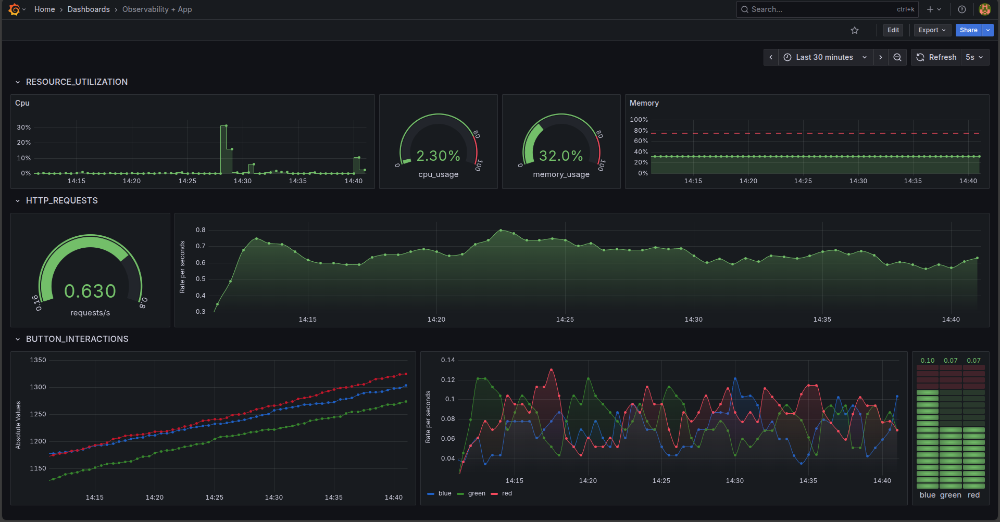

## Panoramica del Progetto

Il progetto implementa un ambiente completo di observability su cluster Kubernetes locale utilizzando Kind (Kubernetes in Docker). L'obiettivo è monitorare un'applicazione Flask instrumentata con OpenTelemetry attraverso uno stack composto da:

- **OpenTelemetry Collector**: Raccolta e processamento delle metriche
- **Prometheus**: Storage e query engine per le metriche
- **Grafana**: Visualizzazione e dashboard interattive
- **NGINX Ingress**: Routing del traffico esterno

## Architettura del Sistema e flusso

```
				┌──────────────────────────────────────────────────────────────┐
				│                    Cluster Kind (obs-cluster)                │
				│                                                              │
				│  ┌──────────────┐    ┌─────────────────┐    ┌────────────┐   │
				│  │              │    │                 │    │            │   │
				│  │ Flask App    │───▶│ OpenTelemetry   │◀───│ Prometheus │   │
				│  │ (Port 5000)  │    │ Collector       │    │            │   │
				│  │              │    │ (Port 4317)     │    │            │   │
				│  └──────────────┘    └─────────────────┘    └────────────┘   │
				│                                                    ▲         │
				│                       ┌─────────────────┐          │         │
				│                       │    Grafana      │──────────┘         │
				│                       │   (Port 3000)   │                    │
				│                       └─────────────────┘                    │
				│                                                              │
				│  ┌─────────────────────────────────────────────────────────┐ │
				│  │              NGINX Ingress Controller                   │ │
				│  │  ┌─────────────┐ ┌─────────────┐ ┌──────────────┐       │ │
				│  │  │flask-app    │ │prometheus   │ │grafana       │       │ │
				│  │  │.example.com │ │.example.com │ │.example.com  │       │ │
				│  │  └─────────────┘ └─────────────┘ └──────────────┘       │ │
				│  └─────────────────────────────────────────────────────────┘ │
				└──────────────────────────────────────────────────────────────┘
				                              │
				                    ┌─────────▼──────────┐
				                    │    Host System     │
				                    │  localhost:80/443  │
				                    └────────────────────┘
```

## Configurazione del Cluster Kind

### File di Configurazione Kind

Il cluster viene configurato attraverso `kind-config.yaml`:

```yaml
kind: Cluster
apiVersion: kind.x-k8s.io/v1alpha4
name: obs-cluster
networking:
  apiServerAddress: "0.0.0.0"  # Ascolta su tutte le interfacce
  apiServerPort: 6443
nodes:
  - role: control-plane
    extraPortMappings:
      - containerPort: 80   # HTTP
        hostPort: 80
        protocol: TCP
      - containerPort: 443  # HTTPS
        hostPort: 443
        protocol: TCP
    kubeadmConfigPatches:
      - |
        apiVersion: kubeadm.k8s.io/v1beta3
        kind: ClusterConfiguration
        apiServer:
          certSANs:
            - "0.0.0.0"
            - "127.0.0.1"
            - "10.0.0.2"  # IP interno del cluster
  - role: worker
```

### Caratteristiche del Cluster

- **Nome**: `obs-cluster`
- **Nodi**: 1 control-plane + 1 worker
- **Porte esposte**: 80 (HTTP) e 443 (HTTPS) mappate dall'host
- **API Server**: Accessibile su tutte le interfacce di rete
- **Certificati**: Configurati per multiple interfacce

## Stack di Observability

### Installazione Prometheus e Grafana

Lo stack viene installato utilizzando Helm con il chart della community:

```bash
helm repo add prometheus-community <https://prometheus-community.github.io/helm-charts>
helm repo update
helm install prometheus prometheus-community/kube-prometheus-stack \\
  --namespace monitoring --create-namespace
```

Questo installa:

- **Prometheus Server**: Raccolta dal collector e storage metriche nel suo TSDB
- **Grafana**: Interroga il DB prom attraverso query PromQL e li rappresenta in dashboard
- **Prometheus Operator**: Gestione automatica delle configurazioni
- **AlertManager**: Gestione degli alert
- **Node Exporter**: Metriche del sistema
- **Kube State Metrics**: Metriche del cluster Kubernetes

### Componenti Installati

| Componente | Service Name | Porta | Descrizione |
| --- | --- | --- | --- |
| Prometheus Server | `prometheus-kube-prometheus-prometheus` | 9090 | Query engine e storage |
| Grafana | `prometheus-grafana` | 80 | Dashboard UI |
| AlertManager | `prometheus-kube-prometheus-alertmanager` | 9093 | Gestione alert |

## Configurazione OpenTelemetry Collector

### ConfigMap del Collector

Il Collector viene configurato attraverso una ConfigMap che definisce:

```yaml
receivers:
  otlp:                    # Riceve metriche dall'app
    protocols:
      grpc:
        endpoint: "0.0.0.0:4317"
      http:
        endpoint: "0.0.0.0:4318"
  prometheus/internal:     # Metriche interne del collector
    config:
      scrape_configs:
      - job_name: 'otel-collector-internal'
        static_configs:
        - targets: ['0.0.0.0:8888']

exporters:
  prometheus:              # Esporta verso Prometheus
    endpoint: "0.0.0.0:9464"
    send_timestamps: true
    resource_to_telemetry_conversion:
      enabled: true

processors:
  batch:                   # Raggruppa metriche per efficienza

service:
  pipelines:
    metrics:
      receivers: [otlp, prometheus/internal]
      processors: [batch]
      exporters: [prometheus]
```

### Porte del Collector

| Porta | Protocollo | Descrizione |
| --- | --- | --- |
| 4317 | gRPC | Ricezione metriche OTLP |
| 4318 | HTTP | Ricezione metriche OTLP |
| 9464 | HTTP | Esposizione metriche per Prometheus |
| 8888 | HTTP | Metriche interne (telemetry) |
| 13133 | HTTP | Health check |

### ServiceMonitor

Il ServiceMonitor configura Prometheus per scoprire automaticamente il Collector:

```yaml
apiVersion: monitoring.coreos.com/v1
kind: ServiceMonitor
metadata:
  name: otel-collector
  namespace: monitoring
  labels:
    app.kubernetes.io/name: otel-collector
    app.kubernetes.io/instance: prometheus
    release: prometheus    # Label critica per l'operator
spec:
  selector:
    matchLabels:
      app: otel-collector
  endpoints:
    - port: metrics        # Porta 9464
      interval: 5s
      path: /metrics
```

## Instrumentazione dell'Applicazione

### Configurazione OpenTelemetry nella Flask App

```python
# Configurazione del provider di metriche
resource = Resource(attributes={SERVICE_NAME: "my-flask-app"})
otlp_endpoint = os.getenv(
    "OTEL_EXPORTER_OTLP_ENDPOINT",
    "<http://otel-collector.monitoring.svc.cluster.local:4317>"
)

# Export delle metriche ogni 5 secondi
metric_reader = PeriodicExportingMetricReader(
    OTLPMetricExporter(endpoint=otlp_endpoint, insecure=True),
    export_interval_millis=5000
)

meter_provider = MeterProvider(resource=resource, metric_readers=[metric_reader])
```

### Tipi di Metriche Implementate

1. **Counter**: Contatori incrementali
    - `app_http_requests_total`: Richieste HTTP per endpoint
    - `app_button_clicks_total`: Click sui pulsanti per colore
2. **Observable Gauge**: Valori istantanei
    - `app_cpu_usage_percent`: Utilizzo CPU del processo
    - `app_memory_usage_percent`: Utilizzo memoria del processo

### Simulazione del Traffico

L'applicazione include thread in background per:

- **Simulazione traffico HTTP**: Genera metriche automatiche
- **Monitoraggio CPU**: Aggiorna regolarmente l'utilizzo CPU
- **Flush periodico**: Forza l'export delle metriche

## Networking e Ingress

### NGINX Ingress Controller

L'Ingress Controller viene installato con configurazione specifica per Kind:

```bash
kubectl apply -f <https://raw.githubusercontent.com/kubernetes/ingress-nginx/controller-v1.8.1/deploy/static/provider/kind/deploy.yaml>
kubectl label nodes obs-cluster-control-plane ingress-ready=true
```

### Configurazioni Ingress

### Applicazione Flask

```yaml
spec:
  ingressClassName: nginx
  rules:
    - host: flask-app.example.com
      http:
        paths:
          - path: /
            pathType: Prefix
            backend:
              service:
                name: flask-hello-world
                port:
                  number: 80
```

### Prometheus

```yaml
spec:
  rules:
    - host: prometheus.example.com
      http:
        paths:
          - path: /
            pathType: Prefix
            backend:
              service:
                name: prometheus-kube-prometheus-prometheus
                port:
                  number: 9090
```

### Grafana

```yaml
spec:
  rules:
    - host: grafana.example.com
      http:
        paths:
          - path: /
            pathType: Prefix
            backend:
              service:
                name: prometheus-grafana
                port:
                  number: 80
```

## Flusso di Comunicazione

### 1. Generazione Metriche

```
Flask App → OpenTelemetry SDK → OTLP Exporter
```

- L'app genera metriche tramite l'SDK OpenTelemetry
- Le metriche vengono serializzate in formato OTLP
- Export automatico ogni 5 secondi

### 2. Raccolta Metriche

```
OTLP Exporter → OTel Collector (gRPC:4317)
```

- Il Collector riceve le metriche via gRPC
- Processa le metriche attraverso il pipeline batch
- Converte le metriche in formato Prometheus

### 3. Storage e Query

```
OTel Collector → Prometheus (HTTP:9464)
```

- Prometheus scrapes il Collector ogni 5 secondi
- ServiceMonitor automatizza la discovery
- Le metriche vengono stored nel TSDB di Prometheus

### 4. Visualizzazione

```
Grafana → Prometheus (HTTP:9090)
```

- Grafana fa delle query Prometheus per le metriche
- Dashboard real-time con refresh automatico
- Visualizzazione di trend e alerting

### 5. Accesso Utente

```
Browser → NGINX Ingress → Service → Pod
```

- Richieste HTTP verso domini specifici
- Ingress Controller routing basato su host
- Load balancing verso i pod dell'applicazione

## Deploy e Test

### Script di Automazione

Il processo completo è automatizzato in `setup_cluster.sh`:

1. **Pulizia**: Rimuove cluster esistente
2. **Creazione Cluster**: Applica configurazione Kind
3. **Configurazione Networking**: Installa NGINX Ingress
4. **Stack Monitoring**: Deploy Prometheus/Grafana via Helm
5. **OpenTelemetry**: Deploy Collector e ServiceMonitor
6. **Applicazione**: Deploy dell'app instrumentata

### Verifica del Deploy

```bash
# Verifica stato dei pod
kubectl get pods -n monitoring

# Verifica ingress
kubectl get ingress -n monitoring

# Verifica metriche del collector
kubectl port-forward -n monitoring svc/otel-collector 9464:9464
curl localhost:9464/metrics

# Verifica ServiceMonitor
kubectl get servicemonitor -n monitoring
```

### Accesso alle Interfacce

- **Applicazione**: [http://flask-app.example.com](http://flask-app.example.com/)
- **Prometheus**: [http://prometheus.example.com](http://prometheus.example.com/)
- **Grafana**: [http://grafana.example.com](http://grafana.example.com/)
    - Username: `admin`
    - Password: `prom-operator`, ottenibile via `kubectl get secret`

### Monitoraggio delle Metriche

Le metriche dell'applicazione sono visibili in Prometheus con prefisso `app_*`:

- `app_http_requests_total`: Counter delle richieste HTTP
- `app_button_clicks_total`: Counter dei click sui pulsanti
- `app_cpu_usage_percent`: Gauge dell'utilizzo CPU
- `app_memory_usage_percent`: Gauge dell'utilizzo memoria

### Dashboard Grafana

Per creare dashboard efficaci:

1. **Query Prometheus**: Usa PromQL per aggregare metriche
2. **Pannelli**: Rate, percentuali, gauge per metriche diverse
3. **Templating**: Variabili per filtrare per servizio/endpoint
4. **Alerting**: Soglie su CPU, memoria, error rate

---

---

### Esempio di Dashboard prodotta per l’applicazione web:

Per configurare questa dashboard sono state utilizzate le 4 metriche disponibili. Attraverso delle query PromQL è stato possibile recuperare sia i semplici valori assoluti che trasformarti attraverso le varie funzioni che Prometheus mette a disposizione. Quindi, da Grafana si è creata una board con vari line chart e gauge counter del rate di queste metriche. Qui sotto il risultato:



## Risoluzione Problemi Comuni

### Collector non riceve metriche

- Verifica variabile `OTEL_EXPORTER_OTLP_ENDPOINT`
- Controlla che il service del Collector sia attivo
- Verifica connettività di rete tra pod

### Prometheus non fa scrapes nel Collector

- Verifica labels del ServiceMonitor
- Controlla che le porte corrispondano
- Verifica selettori del ServiceMonitor

### Ingress non funziona

- Verifica che l'Ingress Controller sia running
- Controlla mapping delle porte nel Kind config
- Verifica configurazione DNS locale

### Metriche non appaiono in Grafana

- Verifica data source Prometheus in Grafana
- Controlla query PromQL nelle dashboard
- Verifica retention policy di Prometheus

## Conclusioni

Questo setup fornisce un ambiente completo di observability locale per lo sviluppo e il testing di applicazioni instrumentate. La configurazione automatizzata permette di replicare rapidamente l'ambiente, mentre la struttura modulare facilita l'estensione con nuovi componenti di monitoring.
